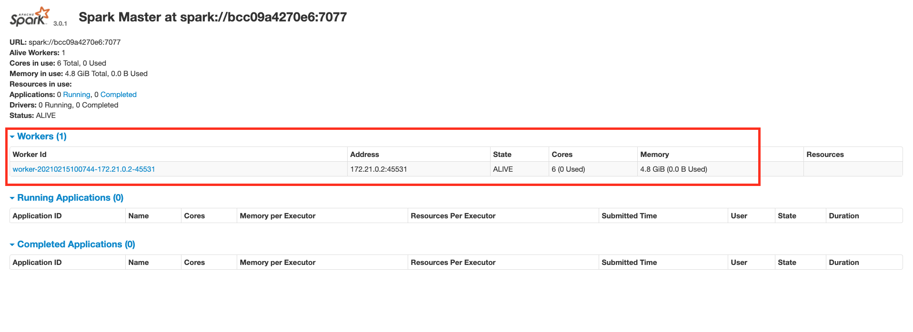
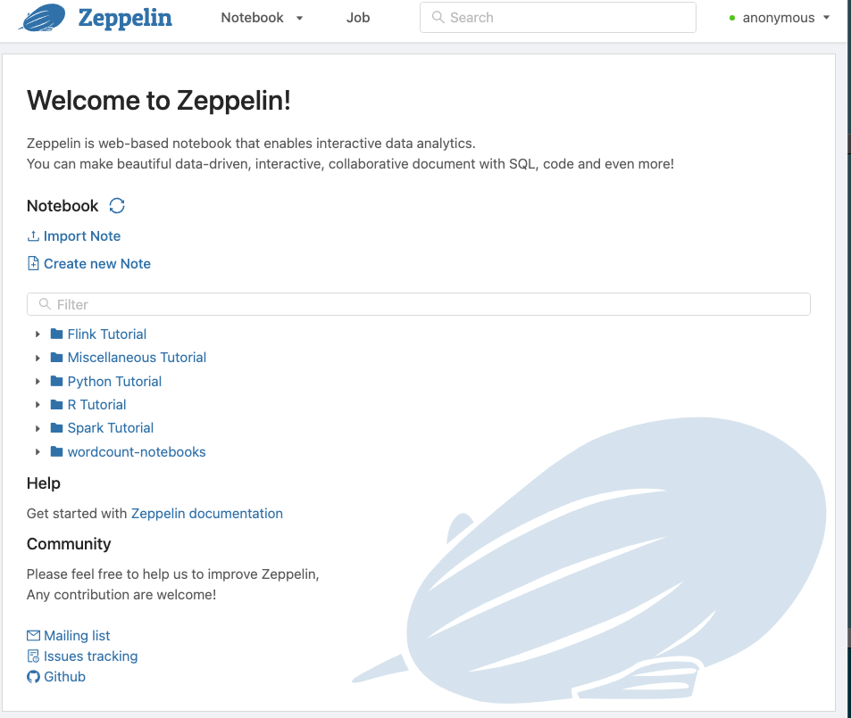

# LakeHouse

components:

- Spark 3.0 with Delta lake preconfigured (http://localhost:8080/ spark master, http://localhost:4040/ spark context)
- Apache zeppelin (http://localhost:9090/)
- Trino (http://localhost:8090/)
- Hive metastore (remote with mariadb)
- Minio (http://localhost:9001/)


A Lake house POC implementation


## Prerequisites
* [docker engine version 20.10.2](https://www.docker.com/products/docker-desktop)
* [docker-compose version 1.27.4](https://docs.docker.com/compose/install/)

## Start your local environment


`docker-compose -f docker-compose.yml -f docker-compose-zeppelin.yml -f docker-compose_HiveMS.yml up`


* Start your local stack by running the above command
  * it will build local spark docker images for spark master and worker
  * it will build a Trino 1 node cluster
  * it will build a Zeppelin server and configure spark and a few datasets/demos
  * it will build a stand-alone Hive metastore and make it accessible to spark and Trino
  * it will build a minio s3 service will also be launched, you can read more about this super useful project [here](https://github.com/localstack/localstack)
* This may take a few minutes the first time you run it


**What's happening?**
* Once done, you can open [localhost:8080](http://localhost:8080/) to view the spark master UI and [localhost:4040](http://localhost:4040/) to watch the spark context after starting the spark application.
* You should see the following UI and a single worker node connected to it:

* We've also started a minio instance running a local minio service which we'll use a s3 mock
  * This local "s3" has two buckets `word-count and spark` with a few csv files that contain information regarding airlines and airports across the world
  * You can read more about this open source project at [https://github.com/jpatokal/openflights](https://github.com/jpatokal/openflights)
  * You can browse this by opening [localhost:9001](http://localhost:9001/)
    * User: `abc`
    * Password: `xyzxyzxyz`
  * See that we've already pushed a sample data set there
  
  * Download and "peek" at the data:
    You should see an output similar to:
```
21251,"Lynx Aviation (L3/SSX)","","","SSX","Shasta","United States","N"
21268,"Jetgo Australia","","JG",\N,"","Australia","Y"
21270,"Air Carnival","","2S",\N,"","India","Y"
21317,"Svyaz Rossiya","Russian Commuter ","7R","SJM","RussianConnecty","Russia","Y"
```
* We've also started a Zeppelin instance. You can access the notebook UI at [localhost:9090](http://localhost:9090/), there are notebooks with demos inside the zeppelin server. Moreover, you can use the commands in the "spark-shell.txt" inside of the zeppelin container to launch a fully configured spark shell sessions.


* We've also started a Trino instance which can be accessed via the web UI at [localhost:8090](http://localhost:8090/), or via a terminal by using the "Trino.jar" file to access the Trino node via the CLI. P.S.: the jar is included in the repo/ please make sure that the jar is executable "chmod +x"


`./trino.jar --server localhost:8090 --catalog hive --schema default`

* We've also started a Hive Metastore instance which uses a Mariadb instance, this metastore is used connected to all the other services


## What's next?
* Once in the zeppelin ui, choose any of the tutorials and start experimenting.
* The custom tutorial notebook written for this repository are the ones under the `airline-notebooks`
